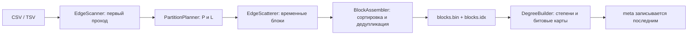

# LeaderRank над графом вне оперативной памяти

В репозитории реализован LeaderRank для ориентированных графов, которые не
помещаются в RAM. `lr-prepare` удаляет петли и дубликаты, затем сохраняет граф
на SSD в двумерной сетке блоков. `lr-rank` выполняет итерации над всей сеткой,
не отбрасывая и не сэмплируя рёбра.

Рабочие массивы адресуются по исходным ID, поэтому они подходят для
неотрицательных и достаточно плотно расположенных ID. Второе ограничение
текущей версии — отдельный блок должен целиком помещаться в буфер сортировки.

## Модель графа и обозначения

Вход — ориентированный список рёбер. После удаления петель и дубликатов получаем
граф $G=(V,E)$.

| Обозначение | Смысл |
|---|---|
| $N=\lvert V\rvert$ | число вершин, встречающихся в оставшихся рёбрах |
| $M=\lvert E\rvert$ | число уникальных рёбер без петель |
| $M_0$ | число распознанных строк до очистки |
| $R=\text{max\_id}+1$ | длина адресного пространства вершин, включая промежутки |
| $B$ | переданный бюджет памяти в байтах |
| $T$ | число потоков, для которого подготовлен `<workdir>` |
| $P$ | число интервалов вершин |
| $L=\lceil R/P\rceil$ | максимальная длина одного интервала |

Разница между $N$ и $R$ существенна. На диске и в оконных массивах вершина
адресуется непосредственно по ID, поэтому память и часть I/O зависят от $R$.
Чтобы единичный ID `2_000_000_000` не превратил небольшой граф в огромный
массив, `lr-prepare` отклоняет вход при

$$
R > 64M_0.
$$

Это не перенумерация: соответствие исходных ID сохраняется. Если ограничение
мешает, вершины нужно заранее перенумеровать и отдельно сохранить обратное
отображение.

## Почему LeaderRank

[LeaderRank](https://journals.plos.org/plosone/article?id=10.1371%2Fjournal.pone.0021202)
— глобальная метрика влияния для ориентированной сети. Она похожа на PageRank,
но вместо настраиваемого коэффициента затухания добавляет служебную вершину —
ground-узел. Он соединён с каждой обычной вершиной в обе стороны.

LeaderRank выбран по четырём причинам:

- каждая итерация проходит по всем рёбрам, то есть метрика применяется ко всему
  графу;
- вершины без исходящих рёбер не требуют отдельного правила: у них остаётся
  ребро в ground-узел;
- в определении метрики нет подбираемого коэффициента затухания;
- вычисление сводится к линейному проходу по рёбрам и хорошо раскладывается на
  блоки.

Здесь «без параметра» относится к определению метрики. У численного метода
по-прежнему есть инженерные параметры `--eps` и `--max-iters`.

### Смысл направления ребра

Ребро $u\to v$ передаёт часть авторитета от $u$ к $v$. В исходной работе
это голос подписчика за лидера: `fan -> leader`. Поэтому направление во входном
датасете нужно проверять, а не угадывать по названиям колонок.

Например, в [SNAP Twitter 2010](https://snap.stanford.edu/data/twitter-2010.html)
ребро $i\to j$ означает, что **$j$ подписан на $i$**. Для семантики
LeaderRank это направление `leader -> fan`, то есть такой файл следует готовить
с `--transpose`.

### Формулы

Пусть $k^{\mathrm{out}}(u)$ — исходящая степень $u$ в очищенном графе,
$s_v^{(t)}$ — текущее значение обычной вершины, а $s_g^{(t)}$ — значение
ground-узла. Начальное состояние:

$$
s_v^{(0)}=1 \quad (v\in V), \qquad s_g^{(0)}=0.
$$

Одна итерация:

$$
s_v^{(t+1)}
=
\sum_{(u,v)\in E}\frac{s_u^{(t)}}{k^{\mathrm{out}}(u)+1}
+\frac{s_g^{(t)}}{N},
$$

$$
s_g^{(t+1)}
=
\sum_{u\in V}\frac{s_u^{(t)}}{k^{\mathrm{out}}(u)+1}.
$$

Единица в знаменателе соответствует ребру из каждой вершины в ground-узел.
Ground-узел распределяет своё значение равномерно между $N$ обычными вершинами.

После сходимости значение ground-узла возвращается обычным вершинам:

$$
\ell_v=s_v^*+\frac{s_g^*}{N}.
$$

В исходной статье сумма значений равна $N$. `RanksCsvWriter` дополнительно
делит каждое значение на $N$, поэтому сумма столбца `rank` в CSV равна единице:

$$
\operatorname{rank}(v)=\frac{\ell_v}{N}.
$$

### Сохранение массы и сходимость

Для каждой обычной вершины доля
$k^{\mathrm{out}}(u)/(k^{\mathrm{out}}(u)+1)$ уходит по исходным рёбрам, а
$1/(k^{\mathrm{out}}(u)+1)$ — в ground-узел. Ground-узел отдаёт всё своё
значение. Поэтому

$$
\sum_{v\in V}s_v^{(t)}+s_g^{(t)}=N
$$

на каждой итерации. `Engine` проверяет этот инвариант и завершает `lr-rank` с
ошибкой, если расхождение превышает заданный численный допуск.

Расширенный граф сильно связен: между любыми вершинами есть путь через
ground-узел. При наличии хотя бы одного оставшегося ребра в нём есть циклы
длины 2 и 3, поэтому цепь апериодична. Матрица перехода примитивна, и по теореме
Перрона — Фробениуса стационарный вектор единственен. Это тот же аргумент,
который приведён авторами LeaderRank.

Критерий остановки в коде:

$$
\delta_t=\frac{1}{N}\sum_{v\in V}
\left|s_v^{(t+1)}-s_v^{(t)}\right| < \varepsilon.
$$

Из сохранения массы следует, что изменение значения ground-узла не больше полной
$L_1$-разницы обычных вершин. Однако без оценки спектрального зазора
$\delta_t$ не является универсальной верхней границей ошибки относительно
стационарного вектора. Поэтому итоговый лог сохраняет и `converged`, и
фактическое `L1/N`.

## Рассмотренные способы хранения

Выбор был между тремя форматами хранения. Каждый позволяет не загружать полный
граф в RAM, но по-разному работает с диском.

| Вариант | Сильная сторона | Цена |
|---|---|---|
| Одномерные шарды и Parallel Sliding Windows, как в [GraphChi](https://www.usenix.org/conference/osdi12/technical-sessions/presentation/kyrola) | Хорошая локальность для входящих рёбер, один активный интервал вершин | Более сложная структура шардов и скользящих окон; источник и назначение ограничены несимметрично |
| Поток рёбер с рассылкой и сборкой обновлений, как в [X-Stream](https://infoscience.epfl.ch/entities/publication/464b1137-af88-43ec-86e4-2d38f7a14f41) | Почти полностью последовательный проход по рёбрам, простой основной формат | На каждой итерации появляется поток обновлений, который нужно записать и затем собрать |
| Двумерная сетка блоков, как в [GridGraph](https://www.usenix.org/conference/atc15/technical-session/presentation/zhu) | Одновременно нужны только окно источников и окно назначений; блоки удобны для параллельной редукции | Окна рангов и степеней перечитываются для каждого столбца; подготовке нужна сортировка каждого блока |

В коде используется третий вариант. Двумерная сетка ограничивает рабочий набор
двумя окнами длины $L$, даже если полный вектор длины $R$ не помещается в RAM.
Сортировка по назначению также даёт детерминированное владение вершинами между
потоками. Из GridGraph взята схема разбиения; формат файлов, планировщик,
подготовка и LeaderRank реализованы в этом репозитории.

## Двумерная сетка

`lr-prepare` делит диапазон `[0, max_id]` на $P$ последовательных интервалов. Блок
$B_{s,d}$ содержит только рёбра, у которых источник находится в интервале
$s$, а назначение — в интервале $d$.

```text
                        интервал назначения
                    d=0        d=1        ...       d=P-1
источник s=0     B(0,0)     B(0,1)                B(0,P-1)
         s=1     B(1,0)     B(1,1)                B(1,P-1)
         ...       ...        ...        ...          ...
         s=P-1   B(P-1,0)   B(P-1,1)              B(P-1,P-1)
```

Физически блоки записаны по столбцам назначения: сначала все
$B_{s,0}$, затем $B_{s,1}$ и так далее. Внутри блока рёбра отсортированы по
`(dst, src)`.

Гиперузел не хранится единым списком смежности:

- исходящие рёбра гиперузла распределяются по интервалам назначений;
- входящие рёбра гиперузла распределяются по интервалам
  источников.

Разбиение помогает, только если соседи попали в разные интервалы.
Если почти все рёбра лежат в одной паре интервалов, соответствующий блок всё
равно будет большим.

## Конвейер подготовки



### `EdgeScanner`: первый проход

`EdgeScanner` делит файл на диапазоны байтов, выравнивает границы по строкам и
параллельно находит `max_id` и $M_0$. При ошибке синтаксического разбора
`EdgeScanner` восстанавливает номер строки отдельным проходом до проблемного
смещения.

### `PartitionPlanner`: выбор разбиения

`PartitionPlanner` выбирает минимально подходящее $P$ из оценок окна,
буферов раскладки и средней ёмкости сортировки. В расчёт входит
`threads_planned`, потому что каждому потоку нужны буферы разбора, I/O и стек.

### `EdgeScatterer`: раскладка рёбер

`EdgeScatterer` читает вход второй раз, отбрасывает петли и помещает остальные
рёбра в буфер соответствующего блока. Заполненные буферы дописываются в
`tmp/b_s_d.raw`. Мьютекс защищает общий буфер блока; порядок рёбер во временном
файле не входит в контракт.

Входной файл является частью контракта двухпроходной подготовки: его нельзя
менять между проходами `EdgeScanner` и `EdgeScatterer`.

### `BlockAssembler`: сборка блоков

`BlockAssembler` целиком читает временный блок в буфер сортировки, параллельно
сортирует части, сливает их в фиксированном порядке и удаляет дубликаты. Затем
он дописывает блок в `blocks.bin`, а его `(offset, count)` — в `blocks.idx`.
Начало каждого блока выровнено на 4096 байт.

Внешней сортировки со слиянием пока нет. Если блок не помещается в отведённый
буфер, `BlockAssembler` завершает подготовку с диагностической ошибкой.

### `DegreeBuilder`: степени и присутствующие вершины

`DegreeBuilder` проходит по `blocks.bin` после дедупликации и строит исходящие
степени. Битовая карта присутствия объединяет вершины с входящими и исходящими
рёбрами. `lr-prepare` записывает `meta` последним: наличие файла служит маркером
завершённой подготовки, но не даёт транзакционных гарантий.

## Итерация ранжирования

Для каждого интервала назначений $d$ `Engine`:

1. обнуляет буфер накопления длины не более $L$;
2. для каждого интервала источников $s$ читает окно текущих рангов и исходящих
   степеней;
3. вычисляет `contrib[u]` по формуле
   $c_u=s_u/(k^{\mathrm{out}}(u)+1)$;
4. один раз за итерацию суммирует `contrib` в новое значение ground-узла;
5. последовательно читает $B_{s,d}$ и прибавляет `contrib[src]` в
   `accumulator[dst]`;
6. добавляет долю старого значения ground-узла только существующим вершинам;
7. считает массу и $L_1$-изменение, затем записывает столбец в следующий файл
   рангов.

После обработки столбца `Engine` переиспользует выделенные окна для следующего.
По завершении итерации `rank_a.bin` и `rank_b.bin` меняются ролями; полный
вектор не копируется.

`Engine` считает новое значение ground-узла при обработке первого столбца,
чтобы не повторять одну сумму $P$ раз.

## Файлы `<workdir>`

```text
<workdir>/
├── meta
├── blocks.bin
├── blocks.idx
├── deg/
│   ├── 0.bin
│   └── ...
├── present/
│   ├── 0.bin
│   └── ...
├── rank_a.bin       # появляются при lr-rank
└── rank_b.bin
```

| Файл | Содержимое |
|---|---|
| `blocks.bin` | пары `uint32_t src, uint32_t dst`, по 8 байт; блоки выровнены и отсортированы |
| `blocks.idx` | $P^2$ записей `uint64_t offset, uint64_t edge_count`, по 16 байт |
| `deg/i.bin` | исходящая степень `uint32_t` для каждого ID интервала |
| `present/i.bin` | один бит на существующую вершину |
| `rank_a.bin`, `rank_b.bin` | `double[R]`, два состояния итерации |
| `meta` | текстовые пары `key=value`: геометрия, счётчики очистки и степени |

Бинарные структуры записываются в нативном представлении. Формат рассчитан на
текущую little-endian x64/Linux-сборку и не содержит сигнатуры, номера версии
или контрольной суммы. `<workdir>` следует считать перестраиваемым кэшем, а не
долговременным форматом обмена между версиями.

## Контракты между компонентами

Зависимости между слоями однонаправленные:

```text
common  ->  grid  ->  prepare
                 ->  rank
```

`common` ничего не знает о LeaderRank, `grid` ничего не знает о CLI, а
`prepare` и `rank` общаются только через `<workdir>`.

| Компоненты | Контракт |
|---|---|
| `CsvEdgeStream` -> `EdgeScanner`, `EdgeScatterer` | Две первые колонки содержат неотрицательные ID типа `int32`; правило распознавания заголовка одинаково в обоих проходах |
| `PartitionPlanner` -> `PartitionScheme` | Любой обработанный ID не превышает `max_id`; `IntervalOf`, длины окон и позиция блока одинаково трактуются всеми последующими стадиями |
| `EdgeScatterer` -> `BlockAssembler` | Каждый временный файл относится ровно к одной паре интервалов; петли уже удалены, дубликаты ещё допустимы |
| `BlockAssembler` -> `DegreeBuilder`, `Engine` | Блоки отсортированы по `(dst, src)` и не содержат дубликатов; индекс указывает на их диапазоны в `blocks.bin` |
| `DegreeBuilder` -> `Engine` | Степени рассчитаны по уникальным рёбрам; битовая карта равна объединению источников и назначений |
| `Meta`, `WorkdirRoot` -> `RankJob` | Геометрия, индекс, файлы степеней и битовые карты принадлежат одному запуску подготовки; `threads_planned` задаёт верхнюю границу числа потоков |
| `Engine` -> `RanksCsvWriter` | `RankResult.rankFileSide` указывает на последнее состояние, а `groundScore` относится к этому же состоянию; `RanksCsvWriter` перераспределяет значение ground-узла |
| `ThreadPool` -> все стадии | `ParallelFor` возвращается только после завершения всех задач; вложенный `ParallelFor` не поддерживается |

`Engine::BuildDstSegments` требует сортировки по `dst`: граница потока
переносится за серию одинаковых `dst`, поэтому один элемент буфера накопления
изменяет только один поток. Созданный вручную несортированный `<workdir>`
нарушает этот контракт.

`WorkdirRoot::Validate` проверяет размеры индекса, минимальный размер
`blocks.bin` и точные размеры файлов степеней. Он не пересчитывает степени, не
проверяет сортировку каждого блока и не проверяет контрольные суммы. Формат
предполагает, что его создал совместимый `lr-prepare`.

## Почему вычисление соответствует формулам

После подготовки каждое ребро простого графа встречается в одном и только одном
блоке. На итерации:

- `DegreeBuilder` даёт точный $k^{\mathrm{out}}(u)$;
- каждое окно источников превращается в
  $s_u^{(t)}/(k^{\mathrm{out}}(u)+1)$;
- проход по всем $P^2$ блокам добавляет этот вклад ровно один раз для каждого
  $(u,v)\in E$;
- сумма тех же вкладов даёт переходы из обычных вершин в ground-узел;
- $s_g^{(t)}/N$ добавляется каждой и только каждой существующей вершине;
- два файла рангов не позволяют читать уже обновлённое значение текущей
  итерации.

Разбиение меняет порядок чтения, но не оператор LeaderRank. Погрешность
возникает только из-за арифметики `double` и выбранного момента остановки;
выборки рёбер или случайного шага нет.

Для графа из условия точное решение после нормировки:

| vertex | rank |
|---:|---:|
| 1 | $25/84 \approx 0.297619047619048$ |
| 2 | $23/84 \approx 0.273809523809524$ |
| 3 | $11/42 \approx 0.261904761904762$ |
| 4 | $1/6 \approx 0.166666666666667$ |

Числа `0.35, 0.25, 0.25, 0.15` в тексте задания обозначены как пример формата
вывода и не являются эталоном LeaderRank для этого графа.

### Что означает точность результата

Разбиение для внешней памяти не меняет набор рёбер: однопоточный и
многопоточный варианты применяют один оператор LeaderRank. Отличие от точного
вещественного решения определяется округлением `double` и ранней остановкой.

При медленном перемешивании `lr-rank` может достичь `--max-iters` раньше
заданного `--eps`. В этом случае утилита записывает последнее приближение и
печатает `converged=false`. Без известного спектрального зазора из одного
$L_1/N<\varepsilon$ нельзя вывести строгую абсолютную ошибку; поэтому ниже
результат сравнивается с независимо построенным стационарным решением.

## Оценка ресурсов

### Планирование RAM

Сначала `PartitionPlanner` выбирает размер порции I/O:

$$
C=\operatorname{clamp}\!\left(
\frac{3B}{20T},
256\,\mathrm{KiB},
4\,\mathrm{MiB}
\right).
$$

Из 85% бюджета вычитается оценка затрат на каждый поток:

$$
U=\lfloor 0.85B\rfloor-
T\left(2C+256\,\mathrm{KiB}+256\,\mathrm{KiB}\right).
$$

Два постоянных слагаемых резервируют стек и буфер синтаксического разбора.

Далее $P$ должен удовлетворять как минимум:

$$
20L \le U,
\qquad
\frac{U}{P^2}\ge 8\,\mathrm{KiB}.
$$

Первое неравенство соответствует двум окнам `double` и одному окну
`uint32_t`: $8L+8L+4L$. Второе оставляет буфер раскладки каждому блоку.

Средняя оценка буфера сортировки:

$$
16M_0 + 4RP + \left\lceil\frac{RP}{8}\right\rceil
\le (U-8\,\mathrm{MiB})P^2.
$$

Она предполагает, что нагрузка распределена между блоками. Фактическая
проверка строже и выполняется для каждого блока:

$$
m_{s,d}\le
\left\lfloor\frac{U-4L}{16}\right\rfloor,
$$

поскольку сортировке нужны два массива восьмибайтовых рёбер и массив степеней.

На этапе ранжирования `MemoryBudget` дополнительно резервирует битовую карту,
порцию I/O, индекс размером $16P^2$ байт, частичные суммы фиксированного размера
и буферы форматирования CSV. Если сумма не укладывается, `lr-rank` завершается
до первой итерации.

`--budget` ограничивает явные рабочие структуры, но не задаёт системный лимит
памяти. Накладные расходы аллокатора, библиотек и файловый кэш контролирует ОС.
Для проверки системного лимита отдельно используется cgroup.

### Время подготовки

Два текстовых прохода занимают $\Theta(F)$, где $F$ — размер входного файла.
Если в блоке $b$ до дедупликации находится $m_b$ рёбер, сортировка требует

$$
\Theta\left(\sum_b m_b\log m_b\right)
$$

сравнений. При равномерном разбиении это примерно
$\Theta(M_0\log\max(1,M_0/P^2))$; при полном перекосе —
$\Theta(M_0\log M_0)$, если такой блок вообще помещается.

`DegreeBuilder` назначает каждому из $T$ рабочих потоков свой диапазон ID
источников, но каждый поток просматривает всю загруженную порцию рёбер. Файл
читается один раз, полезных обновлений остаётся $\Theta(M)$, а суммарное число
проверок равно $\Theta(TM)$. Эта схема не требует синхронизации при обновлении
степеней, но при большом $T$ ограничивает ускорение подготовки.

### Время и I/O ранжирования

За одну итерацию:

$$
\operatorname{CPU}=\Theta(M+PR).
$$

Член $PR$ появляется потому, что окна рангов и степеней источников
пересчитываются для каждого столбца назначений.

Доминирующий объём чтения и записи за итерацию, без служебных данных и
выравнивания:

$$
8M + 12PR + 16R + \frac{R}{8}\quad\text{байт}.
$$

Здесь $8M$ — один проход по рёбрам, $12PR$ — окна рангов и степеней,
$16R$ — чтение старого и запись нового состояния при финализации столбцов,
$R/8$ — битовая карта. Для $K$ итераций время
$\Theta(K(M+PR))$. В худшем случае скорость сходимости зависит от
спектрального зазора; универсального малого $K$ у LeaderRank нет. Практический
потолок задаёт `--max-iters`.

### Диск

Постоянная часть подготовленного `<workdir>` занимает приблизительно

$$
8M + 4R + \frac{R}{8}
+O(4096P^2)\quad\text{байт}.
$$

Во время подготовки дополнительно существуют временные сырые блоки. При
ранжировании добавляются два вектора — ещё $16R$ байт — и выходной CSV.

## Многопоточность и детерминизм

Параллельность используется на обоих этапах:

- `EdgeScanner` и `EdgeScatterer` делят входной файл по границам строк;
- `BlockAssembler` параллельно сортирует части блока, затем сливает их;
- `DegreeBuilder` делит диапазоны ID источников, а
  `BlockAssembler::CountColumnEdges` — назначений;
- `Engine` распределяет серии одинаковых `dst` между потоками;
- `Engine` сводит значение ground-узла, массу и $L_1$ фиксированными частями;
- `RanksCsvWriter` параллельно форматирует строки и записывает их по возрастанию
  ID.

Порядок, в котором потоки дописывают временный блок, может различаться. После
сортировки каждый такой блок получает один и тот же порядок. При ранжировании
потоки не складывают значения в один элемент буфера накопления, а частичные
суммы объединяются в порядке номеров частей. Поэтому число потоков не меняет
последовательность редукции, и итоговый CSV воспроизводим побайтно на одной
архитектуре.

Алгоритм ранжирования не использует генератор случайных чисел. Параметр `seed`
нужен только синтетическому генератору тестовых данных.

## Проверка результатов

### Автоматические тесты

- 93 из 93 тестов CTest проходят;
- Clang 18 и libc++ собирают тот же код в контейнере Ubuntu 22.04;
- [`scripts/reference_rank.py`](scripts/reference_rank.py) независимо проверяет
  стационарное решение.

### Большой фиксированный граф

Вход воспроизводится командой:

```sh
mkdir -p data/raw
.venv/bin/python scripts/gen_synthetic.py \
  --vertices 2000000 \
  --avg-degree 12 \
  --hypernodes 3:50000 \
  --seed 42 \
  --out data/raw/synthetic_seed42.csv
```

Характеристики набора и подготовленного рабочего каталога:

| Показатель | Значение |
|---|---:|
| Размер CSV | 353 798 314 байт (337.41 MiB) |
| Строк рёбер $M_0$ | 23 746 953 |
| Уникальных рёбер $M$ | 23 528 540 |
| Вершин $N$ | 2 000 000 |
| Разбиение при 128 MiB, $T=8$ | $P=3$ |
| Максимальная исходящая степень | 423 003 |
| Максимальная входящая степень | 49 408 |
| `<workdir>` до файлов рангов | 196 494 328 байт (187.39 MiB) |
| `<workdir>` с двумя файлами рангов | 217.91 MiB |

CSV больше лимита RAM, а подготовленный граф на диске также больше лимита.
Высокие степени воспроизводятся при повторной генерации: генератор использует
PCG64 с фиксированным `--seed`.

### Жёсткий лимит памяти: 128 MiB

Обе стадии запускались в cgroup с `memory.max=128 MiB` и без дополнительного
пространства подкачки, с `--threads 8`:

| Стадия | Пиковый RSS процесса | Пиковое значение cgroup | Результат |
|---|---:|---:|---|
| `lr-prepare` | 72 364 KiB | 134 217 728 байт | код возврата `0`, OOM killer не завершил процесс |
| `lr-rank` | 17 996 KiB | 68 538 368 байт | 28 итераций, `converged=true`, код возврата `0` |

Во время `lr-prepare` cgroup дошёл до лимита из-за файлового кэша; ядро
вытесняло страницы, но не завершило процесс. Поэтому
`getrusage().ru_maxrss` недостаточно для проверки общего потребления памяти.

### Сравнение с независимой реализацией

`scripts/reference_rank.py` отдельно строит разреженную матрицу переходов и
использует более строгий порог `eps=1e-12`. Для большого фиксированного графа:

| Проверка | Результат |
|---|---:|
| Максимальная абсолютная разница рангов | $1.32\cdot10^{-14}$ |
| Средняя абсолютная разница | $9.16\cdot10^{-17}$ |
| Корреляция Спирмена | 1.000000 |
| Совпадение первых 100 вершин | 100 из 100 |
| Сумма рангов C++ CSV | 1.0000000000000207 |

Скрипт загружает матрицу в память и не запускался под лимитом 128 MiB. Он нужен
для независимой проверки результата, а не для измерения производительности.

### Воспроизводимость между потоками

На одном и том же `<workdir>` результаты для $T=1$ и $T=8$ совпали побайтно.
SHA-256 CSV:

```text
a56b3836c99d89a8fa509f32405756f838985bd2f56c776738f8a2d03c238700
```

Этот же файл получен локальной macOS-сборкой и сборкой в Ubuntu-контейнере.

### Масштабирование по потокам

Измерения выполнены 28 июля 2026 года на Apple M4 Pro (14 ядер, 48 GB RAM),
macOS 26.3.1 и локальном SSD с APFS. Использовались Apple Clang 21, сборка
`Release`, бюджет 128 MiB и граф из предыдущего раздела. Каждая конфигурация
запускалась три раза; в таблице приведена медиана. Файловый кэш между прогонами
не очищался. Время `lr-prepare` включает оба прохода по CSV и сборку рабочего
каталога, время `lr-rank` — итерации и запись CSV.

| Потоки | `lr-prepare`, с | Ускорение | RSS `lr-prepare`, MiB | `lr-rank`, с | Ускорение | RSS `lr-rank`, MiB |
|---:|---:|---:|---:|---:|---:|---:|
| 1 | 3.414 | 1.000 | 102.03 | 1.781 | 1.000 | 18.47 |
| 2 | 2.625 | 1.301 | 93.81 | 1.223 | 1.456 | 18.47 |
| 4 | 1.917 | 1.781 | 77.41 | 0.978 | 1.821 | 18.50 |
| 8 | 1.965 | 1.737 | 70.03 | 0.921 | 1.934 | 16.97 |

При восьми потоках ускорение составило $1.74\times$ для `lr-prepare` и
$1.93\times$ для `lr-rank`. Дальнейший рост ограничивают I/O, файловый кэш,
последовательные участки и проход `DegreeBuilder` стоимостью $\Theta(TM)$.

### Отрицательный тест на перекос

Для специально скошенного CSV размером 2 GiB, $M_0=133\,684\,830$,
`PartitionPlanner` при 128 MiB и $T=8$ выбрал $P=7$. `EdgeScatterer` завершил
раскладку, но блок `(1, 0)` с 4 194 062 рёбрами не поместился в буфер
сортировки. `BlockAssembler` остановил подготовку до выделения памяти сверх
бюджета и напечатал
`block ... does not fit into prepare memory: increase --budget`.

Средняя оценка заполненности планировщика не гарантирует, что любой отдельный
блок поместится в память.

## Ограничения и непокрытые случаи

1. **Плотность ID.** Рабочие массивы адресуются по исходному ID. Ограничение
   $R\le64M_0$ отсекает крайние случаи, но не заменяет компактную
   перенумерацию.
2. **Нет отдельного файла вершин.** Изолированную вершину невозможно выразить
   списком рёбер. Вершина, представленная только петлёй, исчезает после очистки.
3. **Семантика простого графа.** Петли удаляются, кратные рёбра становятся
   одним. Если кратность должна означать вес, эта реализация не подходит.
4. **Упрощённый разбор CSV.** Первая содержательная строка пропускается как
   заголовок, если первые две колонки не выглядят числами. Поэтому повреждённая
   первая строка данных может быть ошибочно принята за заголовок. CSV с
   кавычками не поддерживается.
5. **Перекошенный блок.** Внутренней сортировке нужен целый блок. Внешняя
   сортировка со слиянием и рекурсивное разбиение блока не реализованы.
6. **`--budget` не равен cgroup.** Программа учитывает собственные буферы, но
   файловый кэш и остальные расходы контролирует ОС. Для жёсткого системного
   лимита нужен запуск под cgroup.
7. **Скорость сходимости.** Ground-узел гарантирует единственный предел, но не
   малое число итераций для любого графа. `--eps` — критерий изменения, не
   доказанная абсолютная ошибка.
8. **Поведение при `--max-iters`.** CSV с последним приближением всё равно
   записывается, предупреждение идёт в `stderr`, код возврата остаётся `0`.
   Автоматизация должна проверять `converged=true`.
9. **Доверенный и версионно-зависимый `<workdir>`.** В формате нет контрольной
   суммы, полной семантической проверки, атомарного переименования и гарантии
   переносимости между архитектурами или версиями. После неудачного
   `lr-prepare` рабочий каталог нужно перестроить.
10. **Двухпроходный вход.** Изменение CSV во время `lr-prepare` может нарушить
    согласованность проходов `EdgeScanner` и `EdgeScatterer`.
11. **Один узел.** Есть многопоточность, но нет распределения по нескольким
    машинам.
12. **Пул потоков fork/join.** Вложенный `ParallelFor` не поддерживается;
    текущий конвейер таких вызовов не делает.

Следующий шаг — внешняя сортировка отдельных блоков. Она снимет ограничение для
неблагоприятно расположенных гиперузлов, не меняя формат итераций LeaderRank.

## Источники

1. L. Lü, Y.-C. Zhang, C. H. Yeung, T. Zhou,
   [“Leaders in Social Networks, the Delicious Case”](https://journals.plos.org/plosone/article?id=10.1371%2Fjournal.pone.0021202),
   PLOS ONE 6(6), 2011. Исходное определение LeaderRank, ground-узел,
   перераспределение значений и аргумент сходимости.
2. X. Zhu et al.,
   [“GridGraph: Large-Scale Graph Processing on a Single Machine Using 2-Level Hierarchical Partitioning”](https://www.usenix.org/conference/atc15/technical-session/presentation/zhu),
   USENIX ATC 2015. Двумерные блоки рёбер и два скользящих окна.
3. A. Roy, I. Mihailovic, W. Zwaenepoel,
   [“X-Stream: Edge-centric Graph Processing using Streaming Partitions”](https://infoscience.epfl.ch/entities/publication/464b1137-af88-43ec-86e4-2d38f7a14f41),
   SOSP 2013. Потоковая обработка рёбер как альтернативный подход для внешней
   памяти.
4. A. Kyrola, G. Blelloch, C. Guestrin,
   [“GraphChi: Large-Scale Graph Computation on Just a PC”](https://www.usenix.org/conference/osdi12/technical-sessions/presentation/kyrola),
   OSDI 2012. Шарды и Parallel Sliding Windows.
5. [Stanford Large Network Dataset Collection](https://snap.stanford.edu/data/).
   Источник готовых ориентированных графов и описаний направления рёбер.
